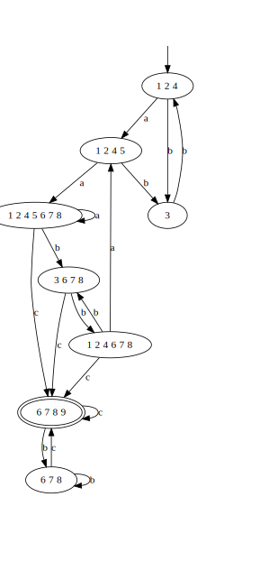

# regex-to-dfa-converter

This repository contains a class which can be used to convert a regular expression to a deterministic finite state automata. The class uses the shunting yard algorithm to convert a regular expression to it's postfix form and then Ken Thompson's algorithm to convert a postfix regular expression to a deterministic finite state automata.

## Compiling and Running

### Prerequisites

To compile and run the program you will need:

- G++
- Makefile
- Grpahviz (for visualizing the output of the program)

### Dependencies installation

G++

```bash
sudo apt install g++
```

Makefile

```bash
sudo apt install make
```

Dot

```bash
sudo apt install graphviz
```

### Running the program

To run the program simply edit the text file `input.txt` adding the regular expression to convert. The first line should contain the alphabet of the regular expression (characters) and the second line a regular expression formed from the characters in the first line and supported operators. The supported operators are:

- `*` - Kleene star, i.e. zero or more repetitions
- `|` - alternation
- `.` - concatenation (represented explicitly)

Additionally you can use parentheses for changing precedence. 

After editing input.txt run:

```bash
make run
```

the output of the program is the deterministic finite state automata written in the dot file format in `dfa.gv`. You can visulaize the automata using:

```bash
dot -Tpng dfa.gv -o dfa.png
```

this will produce a png file `dfa.png` containing the representation of the automata.

For example the following input:

```
a b c
(a|b.b)*.a.a.(b|c)*.c
```

will produce a dot file with a visual representation which looks like this:
